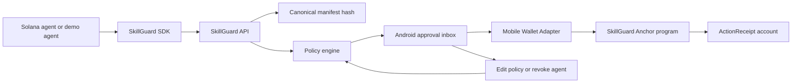

# SkillGuard


SkillGuard is the permission layer for Solana agents: agents request wallet actions, user policies evaluate them, the user approves from mobile, and the decision can be proven with a Solana receipt.

## Problem

Solana agent skills make it increasingly easy for AI agents to call wallets, DeFi protocols, infrastructure APIs, and paid resources. The missing layer is user control:

- users need to understand what an agent wants to do before signing
- agents need a standard way to request approval without receiving private keys
- hackathon demos need a clear audit trail for approvals, rejections, and revocations

## Solution

SkillGuard turns agent output into an `ActionManifest`, checks it against a per-agent policy, shows the wallet impact in an Android approval inbox, and records the decision through a small Anchor receipt program.

```text
Agent proposes action
  -> ActionManifest
  -> policy evaluation
  -> Android approval / rejection / revocation
  -> Mobile Wallet Adapter signing
  -> SkillGuard Solana receipt
```

## Architecture



Core workspaces:

- `packages/protocol`: shared manifest types, canonical hashing, fixtures, policy engine
- `packages/sdk`: TypeScript client for agent developers
- `apps/api`: local API for agents, connections, policy evaluation, and decisions
- `apps/demo-agent`: deterministic safe, unsafe, and revoked action flows
- `apps/mobile`: Android approval app using the SkillGuard design system
- `apps/site`: public project site and canonical visual reference
- `programs/skillguard`: Anchor program for user profiles, agent policies, revocation, and receipts

## Demo Flow

The judge demo is a 3-minute vertical slice:

1. User opens the Android app and connects a devnet wallet.
2. User sees `Research Agent` and its permission policy.
3. Demo agent submits an unsafe request; SkillGuard flags `spend_exceeds_max`.
4. Demo agent submits a safe request; user approves it from mobile.
5. The decision is recorded as a SkillGuard receipt.
6. User revokes the agent; future requests are blocked.

See [docs/DEMO.md](docs/DEMO.md) for exact commands and spoken lines.

## Run The Local Demo

```bash
cp .env.example .env
. scripts/dev-env.sh
scripts/dev-demo.sh
```

The script starts the API and project site, then runs the unsafe, safe, and revoked demo-agent paths. If port `5173` is already used, run:

```bash
SKILLGUARD_SITE_PORT=5174 scripts/dev-demo.sh
```

In a second terminal, run the mobile app when the script prints the Android command.

Manual commands:

```bash
npm --prefix apps/api run dev
npm --prefix apps/demo-agent run submit:unsafe
npm --prefix apps/demo-agent run submit:safe
npm --prefix apps/demo-agent run submit:revoked
```

Build a local debug-signed Android APK:

```bash
. scripts/dev-env.sh
scripts/build-mobile-apk.sh
```

APK output for the default development profile:

```text
build/mobile/skillguard-debug.apk
```

Build a standalone local APK with the JavaScript bundle embedded:

```bash
SKILLGUARD_ANDROID_BUILD_PROFILE=standalone scripts/build-mobile-apk.sh
```

Standalone local output:

```text
build/mobile/skillguard-standalone-debugsigned.apk
```

Build a release-mode APK with a private upload keystore kept outside git:

```bash
SKILLGUARD_ANDROID_BUILD_PROFILE=release \
SKILLGUARD_ANDROID_KEYSTORE_PATH=/absolute/path/to/skillguard-upload.jks \
SKILLGUARD_ANDROID_KEYSTORE_PASSWORD=... \
SKILLGUARD_ANDROID_KEY_ALIAS=skillguard-upload \
SKILLGUARD_ANDROID_KEY_PASSWORD=... \
scripts/build-mobile-apk.sh
```

Release output:

```text
build/mobile/skillguard-release-signed.apk
```

These APKs are local build artifacts ignored by git. The standalone profile is debug-signed; the release profile uses an external keystore through Gradle signing injection.

## Agent SDK

```ts
import { createSkillGuardClient } from "@skillguard/sdk";

const client = createSkillGuardClient({ apiUrl, agentId, agentSecret });
const action = await client.submitAction(manifest);
const decision = await client.onDecision(action.actionId);
```

Agents never receive the user's private key. They submit a manifest to SkillGuard and wait for a decision.

## Solana Program

- Anchor program ID: `HScpxWTMba1w73S4Qc7RZLm8nTj1SnRNBiANWbgaNNam`
- Program path: `programs/skillguard`
- Network: devnet
- Deploy transaction: `5qQzTVjGXrGQiMRAD6vaSt3aKTXLHVB7SwZBtfxoYFPZ753hdeSp2gVLavVBNZtXrsF6cdJ5QQHa4GVkdp6mrtom`
- ProgramData address: `3sFMAGAUY2KwcE9PsM1peQisLkzXWfAjsqXHZR9aZ3By`
- IDL account: `7DosFKnbsmXM1CFM2gAi1Y5AUuRqBE31RjFJtU5osz46`
- Upgrade authority: `Dd6tZmDnTaj9peCbFYdx91CzUEk9YGm1xYqct1UkTdTx`

Verified with:

```bash
solana program show HScpxWTMba1w73S4Qc7RZLm8nTj1SnRNBiANWbgaNNam
```

The program stores compact public facts:

- user profile
- agent connection and policy
- revocation state
- action receipt with manifest hash
- optional execution signature hash

## Security Boundary

SkillGuard enforces policy only for actions that go through SkillGuard.

The MVP does not claim universal wallet protection, does not custody funds, and does not give agents private keys. Token-moving actions still require user wallet signing unless a future limited delegation module is added.

## Public Site

The project site lives in `apps/site` and is the visual source of truth for the mobile UI, README screenshots, pitch walkthroughs, and public homepage.

```bash
npm --prefix apps/site run dev -- --host 0.0.0.0
```

It includes the public pitch, problem statement, architecture, demo flow, developer SDK snippet, security boundary, roadmap, and brand system.

## Hackathon Scope

Core scope:

- Solana: Anchor/Rust receipt program.
- Solana Mobile: Android approval app using Mobile Wallet Adapter.
- Agents: deterministic demo agent plus reusable TypeScript SDK.
- UX: safe request, unsafe request, approval, rejection, revocation, receipt timeline.

Optional extensions after the vertical slice is stable:

- LI.FI route preview.
- x402 paid risk report.
- Solana Agent Kit generated action manifests.

## Repository Layout

```text
apps/
  mobile/       Android app, Mobile Wallet Adapter, approval UX
  api/          SkillGuard API, policy engine, webhooks
  demo-agent/   Sample agent that integrates with SkillGuard
  site/        Public project site and visual source of truth
programs/
  skillguard/   Anchor program for agent connections, policies, receipts
packages/
  sdk/          TypeScript SDK for agent developers
docs/
  PRODUCT.md
  ROADMAP.md
  FEASIBILITY.md
  CRITICAL_FEASIBILITY_STUDY.md
  ARCHITECTURE.md
  DESIGN_SYSTEM.md
  DEMO.md
  superpowers/plans/2026-05-08-skillguard-mvp.md
assets/
  brand/
```

## Planning Docs

- [Product](docs/PRODUCT.md)
- [Critical Feasibility Study](docs/CRITICAL_FEASIBILITY_STUDY.md)
- [Architecture](docs/ARCHITECTURE.md)
- [Roadmap](docs/ROADMAP.md)
- [Demo](docs/DEMO.md)
- [Submission Checklist](docs/SUBMISSION.md)
- [Design System](docs/DESIGN_SYSTEM.md)
- [Operating Protocol](docs/OPERATING_PROTOCOL.md)
- [MVP Implementation Plan](docs/superpowers/plans/2026-05-08-skillguard-mvp.md)

## Development Standard

Every implementation step follows the operating protocol:

```text
test -> implement -> document -> verify -> stage -> pre-commit -> audit -> fix -> re-verify -> commit -> next step
```

See [Operating Protocol](docs/OPERATING_PROTOCOL.md).

For local Solana and Android commands on the verified macOS/Homebrew setup:

```bash
. scripts/dev-env.sh
```

## Status

Core MVP scaffolding is implemented locally: shared protocol, API, Anchor receipt program, mobile approval demo, demo agent, TypeScript SDK, and local demo orchestration all run behind the precommit gate.

Submission blockers still to close:

- final store/upload keystore owner decision
- public site deployment after GitHub Pages is enabled
- demo video and final screenshots

Verified submission proofs:

- Devnet program: `HScpxWTMba1w73S4Qc7RZLm8nTj1SnRNBiANWbgaNNam`
- Mobile Wallet Adapter `record_decision` signature: `5FQoAasPEDvWuNcpDcHzJS3svM8Mz8v2Nnkjw2PSEYLNPAtjNeR1CCw6vzKumKPF8EydB5yv8nQKTwW4LsotRijF`
- Standalone local Android APK: `build/mobile/skillguard-standalone-debugsigned.apk`
- Release signed Android APK proof artifact: `build/mobile/skillguard-release-signed.apk`
- Release signing pipeline: `SKILLGUARD_ANDROID_BUILD_PROFILE=release scripts/build-mobile-apk.sh`
- GitHub Pages deployment workflow: `.github/workflows/deploy-site.yml`
